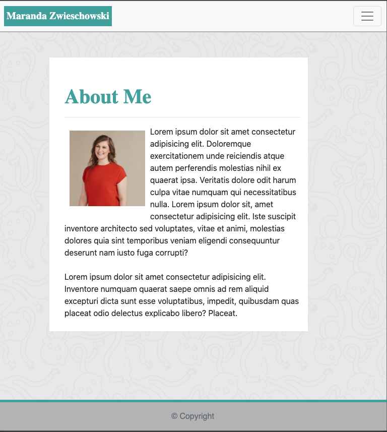
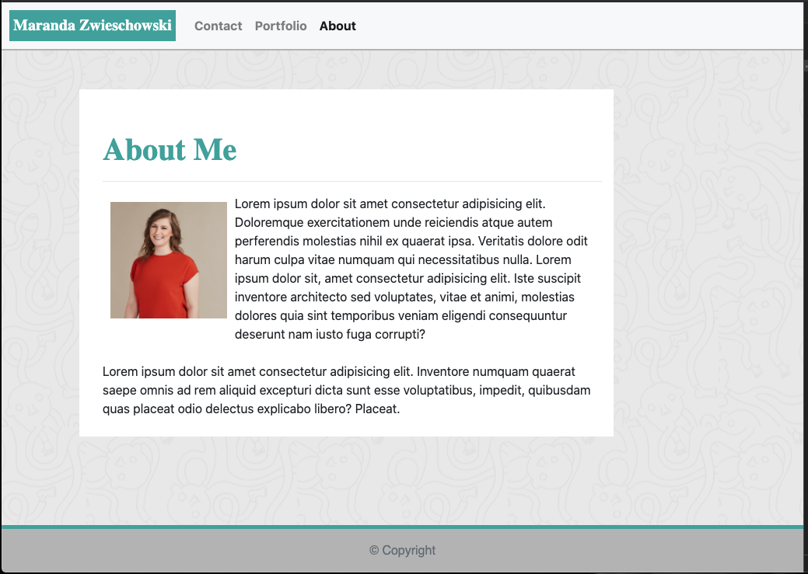
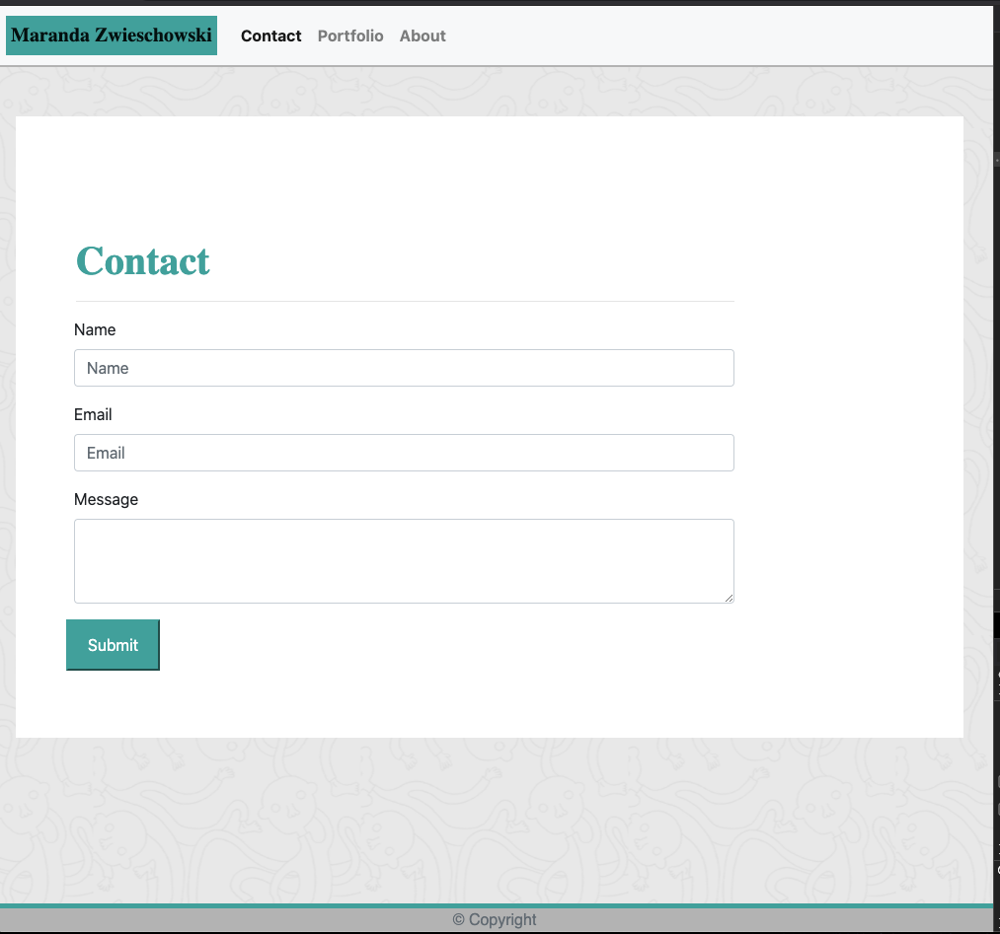

# Responsive Portfolio with CSS, HTML and Bootstrap

## Description 

Creation of a responsive portfolio using CSS, HTML and bootstrap.

The task of this activity was to take screenshots of a responsive website and recreate it using tools such as bootstrap. This was helpful in gaining a better understanding of how bootstrap can be used as an "out of the box" method for creating pages.  My original CSS file was accidentally deleted and unrecoverable as well, so it was a good exercise in learning to proceed with caution when deleting files, or be prepared to put puzzle pieces together when having to recreate one for styling. 

## Installation

No installation needed. This runs in the browser.

## Credits
Below is a list of the resources used to complete this project:  

-Formatting and styling using [Bootstrap](https://getbootstrap.com/).  

-Images taken from [Placeholder.com](https://via.placeholder.com/350x350).  

Maranda Zwieschowski 
[Link to Github](https://github.com/marandaz) ||
[Deployed Portfolio](https://marandaz.github.io/portfolio-css-html-bootstrap/)

